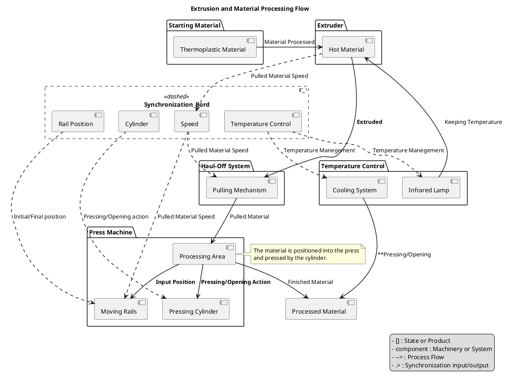

# Interactions between the components

The synchronization bord is connected to all components of the machine and oversees the entire process, ensuring that all data flows through it. It controls and synchronizes every aspect of the operation.

Synchronization Control:
  - infrared lamp / cooling system
  - cylinder action
  - rail position and speed
  - haul-Off speed
  - Safety alarm
  - emergency stop