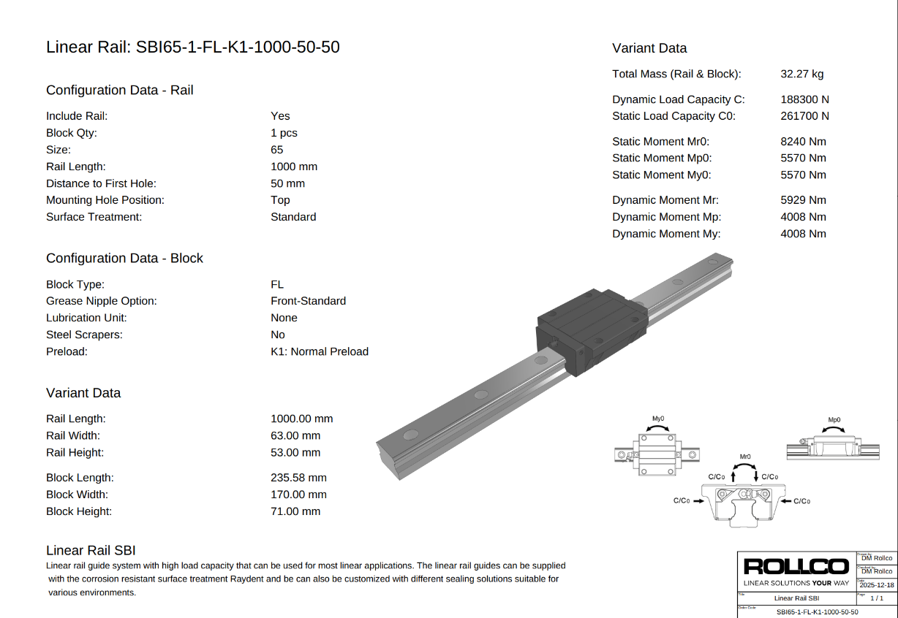
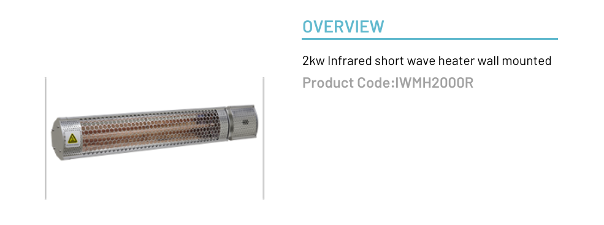
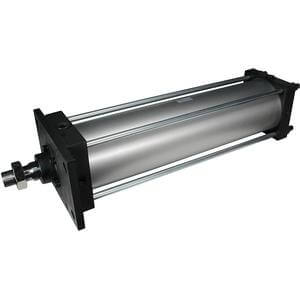

# Purchase list
| Item | Description           | Quantity    | Value    | Price (€) |
|------|-----------------------|-------------|----------|-----------|
| 1    | Current extrusion     | 1           | -        | 0         |
| 2    | Current extrusion die | 1           | -        | 0         |
| 3    | Linear rails          | 1 couple    | -        | 100-200   |
| 4    | Linear rails motor    | 1           | -        | -         |
| 5    | Cylinder              | 1           | d250mm   | 400-600   |
| 6    | Infrared Lamp         | 1           | 1-2 kW   | 140       |

## plc

## Linear rails

## Infrared lamp

## Cylinder

